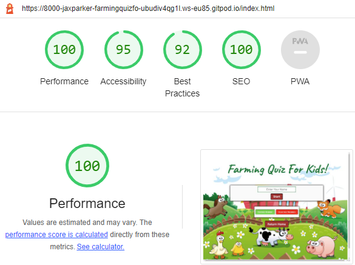

## Farming Quiz For Kids!

## Table of Contents
* [Purpose](#Purpose)
* [User Experience Design (UX)](#User-Experience-Design)
  * [User stories](#User-Stories)
    * [First Time Visitor Goals](#First-Time-Visitor-Goals)
    * [Returning Visitor Goals](#Returning-Visitor-Goals)
    * [Frequent User Goals](#Frequent-Visitor-Goals)
  * [Structure](#Structure)
  * [Design](#Design)
    * [Colour Scheme](#Colour-Scheme)
    * [Typography](#Typography)
    * [Imagery](#Imagery)
    * [Wireframes](#Wireframes)
    * [Differences to Design](#Differences-to-Design)
    * [Limitations](#Limitations)
    * [Features](#Features)
    * [Existing Features](#Existing-Features)
    * [Future Features](#Features-Left-to-Implement)
* [Technologies](#Technologies)
* [Testing](#Testing)
    * [Test Strategy](#Test-Strategy)
      * [Summary](#Summary)
      * [Validation](#Validation-Test-Cases)
    * [Test Results](#Test-Results)
    * [Testing Issues](#Issues-and-Resolutions-to-issues-found-during-testing)
* [Deployment](#Deployment)
    * [Project Creation](#Project-Creation)
    * [GitHub Pages](#Using-Github-Pages)
* [Credits](#Credits)
  * [Content](#Content)
  * [Media](#Media)
  * [Acknowledgements](#Acknowledgements)

  # Project 2 Farming Quiz For Kids!
  ## Purpose
  This website was created for the sole purpose of completing the second project for the Code Institues's Full Stack Developer Course. It was built using the knowledge gained from the HTML, CSS and JavaScript courses, Scrimba course and YouTube videos. A full list of technologies used can be found in the technologies section of this document. The Farming Quiz For Kids site was built as a simple quiz for children all about farming in order to teach children about farming whilst having fun playing. The site is targeted at children, using bright colours, fun images and simple questions on an easy to use interface which allows the child to navigate through the questions, play again or return to the home page. The page is personal, allowing the child to enter thier name and return it giving an encouraging message at the end of the game.

  The live website can be found [here] (https://jax-parker.github.io/Farming_Quiz_For_Kids/).

  ## Farming Quiz For Kids!

***
## User Experience Design

### User stories
#### First Time Visitor Goals

    * As a first time visitor, I want to be able to immediately understand the main purpose of the application, "Farming Quiz For Kids!".
    * As a first time visitor, I want to be able to understand how to enter my name.
    * As a first time visitor, I want to be able to understand how to start the quiz.
    * As a first time visitor, I want to be able to understand if my question was correct or incorrect.
    * As a first time visitor, I want to be able to understand how to navigate to the next question.
    * As a first time visitor, I want to be see a personlised message to encourage me to play again.
    * As a first time visitor, I want to be able to understand how to navigate back to the homepage or replay the quiz.
    * As a first time visitor, I want to use the site to improve my knowledge of farming.
    * As a first time visitor, I want the game to be responsive to my device, no matter what size or orientation my screen is.

#### Returning Visitor Goals

    * As a returning visitor, I want to be familiar with the site and use my experience to to navigate through the quiz.
    * As a returning visitor, I want to be see a personlised message to encourage me to play again.
    * As a returning visitor,I want to use the site to improve my knowledge of farming.
    * As a returning visitor, I want the game to be responsive to my device, no matter what size or orientation my screen is.

#### Frequent Visitor Goals

    * As a frequent visitor, I want to be familiar with the site and use my experience to to navigate through the quiz.
    * As a frequent visitor, I want to be see a personlised message to encourage me to play again.
    * As a frequent visitor, I want to use the site to improve my knowledge of farming.
    * As a frequent visitor, I want the game to be responsive to my device, no matter what size or orientation my screen is.

## Structure
All pages will have big buttons with easy to read functions allowing you to navigate through the game easily and two bright buttons to explain if the answers are correct or incorrect with correlating colours with the answers when clicked on. The fonts will be easy to read. The background will be colourful with animated farm animals to appeal to children and the interface will be easy to use so that younger children can play too.

### The child will be able to enter their name through the input box in order to receive and encouraging message at the end. 
The purpose of this is to fulfil user story: 
> As a first time visitor, I want to be able to understand how to enter my name. 
> As a first time visitor, I want to be able to understand how to start the quiz. 
> As a returning visitor, I want to be familiar with the site and use my experience to to navigate through the quiz. 
> As a frequent visitor, I want to be familiar with the site and use my experience to to navigate through the quiz. 

### The child will be able to clearly read the questions, click on an answer and use the colours of the boxes to match with the colours of the menu underneath to see if their answer was correct or incorrect.
The purpose of this is to fulfil user story: 
> As a first time visitor, I want to be able to understand if my question was correct or incorrect. 
> As a first time visitor, I want to be able to understand how to navigate to the next question. 
> As a first time visitor, I want to use the site to improve my knowledge of farming. 
> As a returning  and frequent visitor, I want to be familiar with the site and use my experience to to navigate through the quiz. 
> As a returning and frequent visitor, I want to use the site to improve m y knowledge of farming. 

### The child will be able to see an encouraging message at the end of the game which is personalised to them. They will then have a choice to replay the game or navigate back to the start.
The purpose of this is to fulfil user story: 
> As a first time visitor, I want to be able to understand how to navigate back to the homepage or replay the quiz. 
> As a first time visitor, I want to be see a personlised message to encourage me to play again. 
> As a first time visitor, I want to be able to understand how to navigate back to the homepage or replay the quiz. 
> As a returning/frequent visitor, I want to be see a personlised message to encourage me to play again. 
> As a returning/frequent visitor, I want the game to be responsive to my device, no matter what size or orientation my screen is. 

### Design
#### Colour Scheme
The colours used compliment or match the farm background and are bright and colourful for children. The darker green for the title and message, the brown for the buttons, the light green and red for correct and incorrect, the gold for the hover colour and the black for borders. The grey is used instead of white for text/backgrounds to give a softer look. 

#### Typography
The title and message font used are **Caveat** which is cursive to give a fun, informal look. All other text used is **Open Sans** with letter spacing to ensure it is easy to read for children. Both fonts were imported from Google Fonts. 

#### Imagery
The background image and favicon were chosen for their fun, friendly, comic nature to appeal to children. The favicon used I already had in my stock images (originally found on the internet) and the background was a license free image from HiClipart and can be found [here](https://www.hiclipart.com/free-transparent-background-png-clipart-ivjgh).

#### Wireframes
Created using Publisher as Balsamiq now charge.

# Differences to design
After comparing the original wireframe designs to the finished website;
* Start section 
  The wireframe, although had boxes for images did not show a background image. There was very little difference in design, although the start button appeared underneath the name input box to keep everything centered and the answer boxes were side by side.
* Question Section 
  Again there was very little difference to the original design, although the responsivness on mobile kept the original layout and was still easy to read.
* Message Section 
  Layout was again, similar to the wireframe. I ensured that the name return was on a separate line to stand out.

### Existing Features
- The website has three sections, the start section where the player can enter their name, the question section, where the player can read and click on their choice of answer then click next for the next question and a message section, where the player gets a message which includes their name. The player can then replay the game or return to the start section where someone else can enter their name and play or they can play again.

### Features Left to Implement
- Add scoring to the question section so the player knows which question they are on and how many are incorrect or correct.
- Maybe add a high scores section that keeps a record of who has played and what score they achieved.
***
## Technologies

* HTML
  * This project uses HTML for the structure of the site.
* CSS
  * Is used to style the site, giving it colour and design.
* JavaScript
  * Is used for the functionality of the site allowing the player to enter their name, click through the questions and play again or return to the start.
* MS Publisher
  * Used to create the wireframes as the free Balsamic license had expired.
* [Google Fonts](https://fonts.google.com/)
	* Google fonts are used throughout the project to import the *Caveat* and *Open Sans* fonts.
* [GitHub](https://github.com/)
	* GithHub is the hosting site used to store the source code for the Website and [Git Pages](https://pages.github.com/) is used for the deployment of the live site.
* [Git](https://git-scm.com/)
	* Git is used as version control software to commit and push code to the GitHub repository where the source code is stored.
* [Google Chrome Developer Tools](https://developers.google.com/web/tools/chrome-devtools)
	* Google chromes built in developer tools are used to inspect page elements and help debug issues with the site layout and test different CSS styles.
* [MS PAINT](https://support.microsoft.com/en-us/windows/get-microsoft-paint-a6b9578c-ed1c-5b09-0699-4ed8115f9aa9)
    * Used to create the wireframe pages and edit the screenshots taken.
* [Favicon](https://favicon.io/)
    * Favicon.io was used to make the site favicon
* [UI.Dev](https://ui.dev/amiresponsive)
    * Multi Device Website Mockup Generator was used to create the Mock up image in this README
***
# Testing

#### Summary
The live project can be found [Here](https://jax-parker.github.io/Farming_Quiz_For_Kids/) 
This project is front end only with no back-end functionality, the testing performed will be on the visual effects, layout and the correct operation of the quiz. Testing to be done on at least three browsers and all screen sizes.

No elements should overlap another container div.

All buttons should work with the appropriate function.

## Accessibility

Accessibility has been taken into account throughout the design of this website to make it user friendly. This has been achieved by: 
  * Using semantic HTML
  * Using a hover state on buttons to ensure clarity to the user of which one they are about to click.
  * Choosing a sans serif font for questions and instructions for easy to read purposes for children and children with dyslexsia.
  * Choosing bright contrasting colours to give clarity to navigation and readability. After running through Google Lighthouse    though the button colours were deemed inaccessable to readers so I used Deque University website to change the colours to a more accessible read. Webite can be found [here](https://dequeuniversity.com/rules/axe/4.4/color-contrast?utm_source=lighthouse&utm_medium=devtools) 
  * Google Lighthouse retest after colour changes 
   

